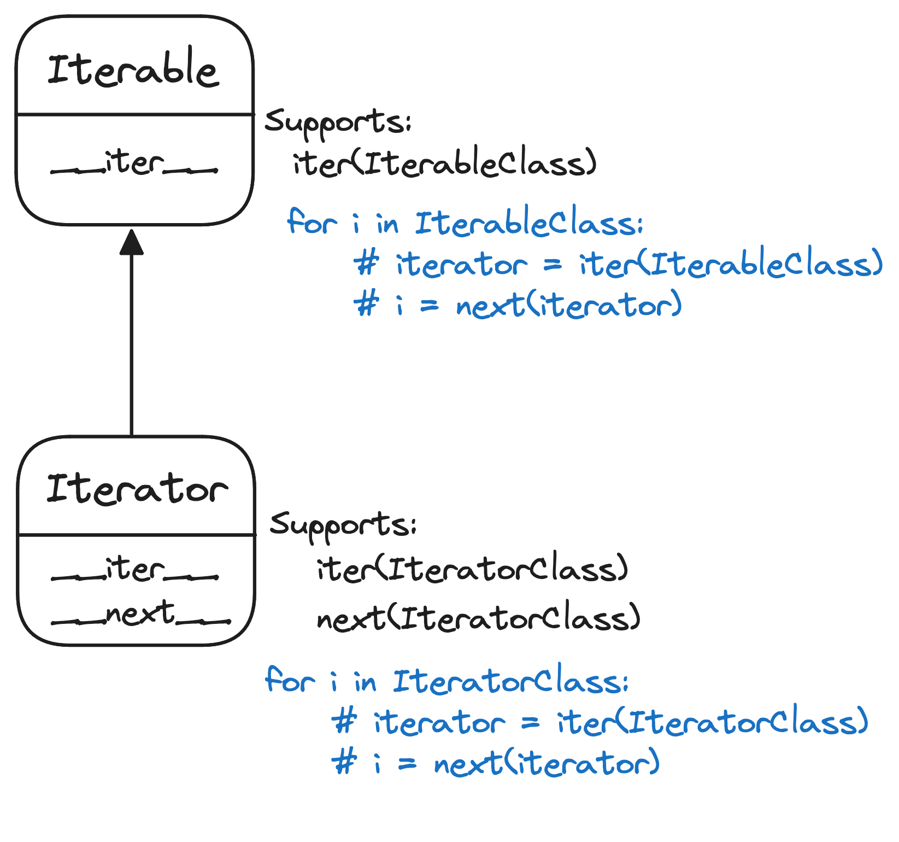

# python-interview-cheatsheet
Topics related to python [RU]

## Python code execution
Python это некоторый интерфейс, описывающий язык программирования и имеющий свою [спецификацию](https://docs.python.org/3.6/reference/index.html). Соответственно, существуют различные реализации этого языка, такие как:
* CPython. Эталонная реализация на C. Пеозволяет писать C-расширения на языке C;
* PyPy. Альтернативаня реализация интерпретатора, преимуществами которого являются скорость, JIT-компиляция, меньшее количество потребляемой памяти и микротреды за счет собственной реализации стека вызовов. Написана на python;
* Jython. Реализация языка Python на языке программирования Java. Имеет стандартную библиотеку как питона, так и джавы. Исходный код компилируется в байткод, который исполняется JVM;
* IronPython. Реализация языка, интегрированная с платформой .NET и написанная на C#. Скомпилированный байткод исполняется виртуальной машиной CLR.

Каждая реализация интерпретатора привносит с собой преимущества того или иного стэка технологий.


Написанный код на питоне проходит через несколько стадий перед его непосредственным выполнением:
* исходный код компилируется в байткод(.pyc)
* полученный байткод строка за строкой интерпретируется виртуальной машиной


### Python virtual machine 
Некоторые языки программирования(такие как C, C++) компилируются в инструкции, которые напрямую исполняются на CPU. Преимуществами такого подхода является скорость выполнения в ущерб скорости компиляции. В Python другой подход -- использование виртуальной машины, на которой исполняется скомпилированный байткод. Интерпретатор в бесконечном цикле считывается байткод и выполняет инструкцию одна за другой. 
### .pyc .pyo .pyz
Python3 компилируют подгружаемые модули в файлы с расширением .pyc и помещает их в директорию __pycache__. Во второй версии питона были также файлы .pyo и .pyz. Файлы с расширением .pyo получаются с использованием флага для оптимизации -O. Файлы .pyz это сжатые в zip архив питоновские файлы.


## Отличия Python2 и Python3
* Python2 - по дефолту строки хранятся в кодировке ascii, Python3 - в кодировке utf-8.
* В python2 print - это выражение, в python3 - функция.
* В python2 `3/2 = 1`. В python3 `3/2 = 1.5`.
* В pyhton2 xrange, в python3 range.
* Официально поддержка python2 закончится в 2020 году.

## Python types and operations
### Dictionaries


#### Six
six - специальный модуль для безболезненного перевода кода на втором питоне в код для третьего питона и наоборот.

## Запуск скриптов
Запустить скрипт можно просто указав название скрипта в качестве аргумента: `python script.py`.

Полезные ключи:
* `-m` -- использовать встроенный модуль. Пример `python3 -m venv venv_name`, `python3 -m pip install requests`. Примечание: совместно с установкой python устанавливается и pip. 
* `-i` -- включить интерактивную оболочку после запуска скрипта. `python3 script.py -i`
* `-O` -- убрать все assert стейтменты. Оптмизация
* `-OO` -- убрать все assert стейтменты и docstrings. Оптмизиация
* `-u` -- сделать вывод в stdout и stderr небуферизированным.
* `-c` -- выполнить команду. `python3 -c "1 + 2"`.

Переменные окружения:
`PYTHONUNBUFFERED=1` -- управляет выводом в stdout и stderr. 

### Exec, eval
В питоне можно запускать код из самого питона. 
* eval(evaluate) выполняет простые выражения и вовзращает результат.
``` python
>>> eval('1 + 1')
2
```
Небезопасно. Можно использовать, например, `os.remove()`
* exec(execute) выполняет стейтменты и выполняет код, ничего не возвращая.
``` python
>>> exec("""a = 1 + 1
... b = a + 1
... print(b)
... """)
```
### Ast, code, codeop
Ast -- abstract syntax tree. Питон после парсинга токенов строит специальную древовидную структуру для исполнения кода.

code -- специальный модуль, предоставляющий возможность заимпелентить цикл read-eval-print в коде.

codeop -- альтернатива модулю code. Предоставляет некоторые утилиты для цикла read-eval-print.

### Code objects. 
Если обратиться к объекту rфункции, то можно заметить специальный атрибут `__code__`, который хранит скомпилированный байткод функции.
```python
>>> def sum(a, b):
...     my_const = 1
...     return sum([a, b])
... 
>>> sum.__code__
<code object sum at 0x7fc0a6f3eae0, file "<stdin>", line 1>
```
Этот объект ассоциирован с тремя тьюплами: 
* локальные переменные(`co_varnames`), включая аргументы.
```
>>>sum.__code__.co_varnames
('a', 'b', 'my_const')
```
* глобальные переменные(`co_names`)
```
>>>sum.__code__.co_names
('sum',)
```
* константы (`co_consts`)
```
>>>sum.__code__.co_consts
(None, 1)
```


## Type
На уровне C питоновский объект представляет из себя структуру, в которой главными атрибутами является количество ссылок на объект и тип этого объекта. Тип определяет, какие операции поддерживаются данным объектом.
```C
typedef struct _object {
    _PyObject_HEAD_EXTRA
    Py_ssize_t ob_refcnt;
    struct _typeobject *ob_type;
} PyObject;
```

В питоне объекты могут быть изменяемыми(mutable) и неизменемыми(immutable).
В случае с неизменяемыми объектами для изменения объекта нужно создать новый. Например, строка это неизмеяемый тип, а список -- изменяемый. 

Когда мы пишем выражение вида `some_str = "something here"` в памяти создается объект str и имя some_str связывается с этим объектом. Количество ссылок у объекта в памяти увеличивается на 1. Когда он удаляется оператором del -- уменьшается на 1.

Mutable
```python
>>> names = ['John']
>>> id(names)
140144987772488
>>> names.append('Gabe')
>>> id(names)
140144987772488
```
Immutable
```python
>>> name = 'John'
>>> id(name)
140144987780240
>>> name = 'Gabe'
>>> id(name)
140144987780296
```
 
Mutable

| type | Mutalbe |
|------|---------|
|list  | True    | 
|dict  | True    |
|set   | True    |
|bytearray | True    |

Immutable

| type | Mutalbe |
|-------|--------|
|frozenset | False |
| int   | False |
| str |False |
| float| False |
| tupe | False |
| bool | False |
|bytes | False    |


### Виды эквивалентности объектов
Функция id() возвращает идентичность объекта(иденфикатор) в виде числового значения, обычно указывающего на ячейку в памяти. Оператор **is** позволяет узнать эквивалентность идентификаторов. Оператор **==** тпозволяет узнать эквивалентность значений. 

```pythonte
>>> a = 'super string 12345aaaaa'
>>> b = 'super string 12345aaaaa'
>>> a is b
False
>>> a == b
True
```

Примечание: в целях производительности CPython кэширует некоторые числа(от -5 до 256) и строки.
```python
>>> first = 256
>>> second = 256
>>> first is second
True
>>> first = 257
>>> second = 257
>>> first is second
False
```

## Types and operations
### Dictionaries
Словарь представляет собой мутабельный контейнерный тип-отображение, хранящий отображение ключей в виде хэшируемых объектов на некоторые другие объекты(хэш таблица).

Создать словарь можно следующим образом:
```python
>>> numbers = {'one': 1, 'two': 2}
>>> numbers
{'one': 1, 'two': 2}
>>> numbers = dict(one=1, two=2)
>>> numbers
{'one': 1, 'two': 2}
>>> numbers = dict.fromkeys(['one', 'two'], 'default')
>>> numbers
{'one': 'default', 'two': 'default'}
>>> numbers = dict([('one', 1), ('two', 2)])
>>> numbers
{'one': 1, 'two': 2}
```

Основные операции:
* получить количество элементов в словаре 
```python
>>> len(numbers)
```
* прочитать элемент по ключу. При отсутвии элемента возникает исключение `KeyError`. Сабкласс может заимпелементить метод `__missing__(key)`, который будет вызываться при отсутствии ключа *key*.
```python
>>> numbers
{'one': 1, 'two': 2}
>>> numbers['one']
1
>>> numbers['not_existing_key']
Traceback (most recent call last):
  File "<stdin>", line 1, in <module>
KeyError: 'not_existing_key'
```

* сопоставить ключ со значением
```python
>>> numbers
{'one': 1, 'two': 2}
>>> numbers['three'] = 3
>>> numbers
{'one': 1, 'two': 2, 'three': 3}
```
* удалить элемент по ключу
```python
>>> numbers
{'one': 1, 'two': 2, 'three': 3}
>>> del numbers['three']
>>> numbers
{'one': 1, 'two': 2}
```
* проверить, присутствует ли ключ в словаре
```python
>>> numbers
{'one': 1, 'two': 2}
>>> 'one' in numbers
True
>>> 1 in numbers
False
```
* получить итератор по ключам
```python
>>> numbers
{'one': 1, 'two': 2}
>>> it = iter(numbers)
>>> next(it)
'one'
```
* очистить словарь 
```python
>>> numbers
{'one': 1, 'two': 2}
>>> numbers.clear()
>>> numbers
{}
```
* взять поверхностную копию объекта
```python
>>> numbers = {'one': 1, 'two': 2}
>>> numbers_copy = numbers.copy()
>>> numbers is numbers_copy
False
>>> numbers == numbers_copy
True
```
* вернуть элемент по ключу, а вслучае отсутствия - элемент по умолчанию
```python
>>> numbers
{'one': 1, 'two': 2}
>>> numbers.get('three', 'empty')
'empty'
>>> numbers
{'one': 1, 'two': 2}
```
* получить список пар ключ/значение(элементов) в виде view-obj
```python
>>> numbers
{'one': 1, 'two': 2}
>>> numbers.items()
dict_items([('one', 1), ('two', 2)])
```
* получить список ключей в виде view-obj
```python
>>> numbers
{'one': 1, 'two': 2}
>>> numbers.keys()
dict_keys(['one', 'two'])
```
* получить список значений в виде view-obj
```python
>>> numbers
{'one': 1, 'two': 2}
>>> numbers.values()
dict_values([1, 2])
```
* удалить элемент по ключу и вернуть его
```python
>>> numbers.pop('two')
2
>>> numbers.pop('two')
Traceback (most recent call last):
  File "<stdin>", line 1, in <module>
KeyError: 'two'
```
* удалить последний элемент в словаре и вернуть его. Под последним понимается последний добавленный элемент
```python
>>> numbers
{'one': 1, 'two': 2, 'three': 3}
>>> numbers.popitem()
('three', 3)
>>> numbers
{'one': 1, 'two': 2}
```
* получить элемент по ключу и в случае отсутвия добавить его в словарь, вернув значение
```python
>>> numbers 
{'one': 1}
>>> two = numbers.setdefault('two', 2)
>>> two
2
>>> numbers
{'one': 1, 'two': 2}
```
* обновить словарь новыми данными(в виде словаря)
```python
>>> numbers
{'one': 1, 'two': 2}
>>> numbers.update({'three': 3})
>>> numbers
{'one': 1, 'two': 2, 'three': 3}
```
### UserDict
Отнаследовавшись от данного класса и поместви словарь в атрибут **data** можно добиться такого же поведения как и обычного словаря
```python
>>> from collections import UserDict
>>> class MyDict(UserDict):
...     def __init__(self, data):
...             self.data = data
...             self.data.update({'from_klass': True})
... 
>>> my_dict = MyDict({'one': 1})
>>> my_dict
{'one': 1, 'from_klass': True}
```
### OrderedDict
Словарь, предоставляющий специальные методы, учитывающие порядок элементов в словаре
* **move_to_end(key, last=True)** - переместить элемент в правый конец(при last=False в левый)
* **popitem(last=True)** - удалить и вернуть элемент из правого конца
```python
>>> from collections import OrderedDict
>>> ordered_dict = OrderedDict({'two': 2, 'one': 1})
>>> ordered_dict
OrderedDict([('two', 2), ('one', 1)])
>>> ordered_dict.move_to_end('two')
>>> ordered_dict
OrderedDict([('one', 1), ('two', 2)])
>>> ordered_dict2 = OrderedDict({'two': 2, 'one': 1})
>>> ordered_dict == ordered_dict2
False
>>> ordered_dict.popitem()
('two', 2)
>>> ordered_dict
OrderedDict([('one', 1)])
```
### defaultdict
Специальный словарь, который в качестве аргумента для инициализатора принимает стаднартный для всех элементов тип, поддерживая тем самым присущие для этого типа операции прямо во время задания нового элемента по ключу
```python
>>> from collections import defaultdict
>>> numbers = defaultdict(list)
>>> numbers['1-10'].append(1)
>>> numbers
defaultdict(<class 'list'>, {'1-10': [1]})
>>> numbers = defaultdict(int)
>>> counter = defaultdict(int)
>>> counter['John'] += 1
>>> counter
defaultdict(<class 'int'>, {'John': 1})
```
### dict comprehension
```python
>>> numbers = ['one', 'two', 'three']
>>> numbers_mapping = {key: value for key, value in zip(numbers, range(1, 4))}
>>> numbers_mapping
{'one': 1, 'two': 2, 'three': 3}
```
### hashable
Хэшируемыми объектами является те объекты, которые в течение своего жизненного цикла имеют неизменяемый хэш. Таке объекты имеют метод `__hash__`, который также используется для проверки эквивалентности значений объекта.
Как правило, большинство неизменяемых типов хэшируемы, нехэшируемыми являются контейнерные типы(как изменяемы так и неизменяемые) - `list`, `dict`. В случае с `frozenset` и `tuple` хэшируемыми они становятся только если все их элементы так же хэшируемы. По-умолчанию все определенные пользовательские типы хэшируемы и получают хэш из `id()`.

### Алгоритм поиска значения по ключу в хэш таблице
* `hash_table['key']` - python вычисляет хэш ключа `hash(key)` и запоминает несколько младших битов полученного числа как смещение ячейки.
* проверяет массив по индексу равным смещению(несколько младших битов хэша). Если она пуста  возбуждает `KeyError`
* если в ячейке находится элемент(пара `ключ:значение`), то сравнивает этот ключ с ключом, который был передан в качестве аргумента функции хэширования. В случае несовпадения имеет место коллизия, python берет смещение относительно другой ячейки и повторяет это действие пока значение не будет найдено. Если ключи совпадают - отдает значение
### Динамическая типизация в python
В python не требуется указывать тип переменной. Тип объекта находися в самом объекте, а имя переменной лишь связывается с этим объектом.

```python
>>> a = 'string'
>>> type(a)
<class 'str'>
>>> a = 1
>>> type(a)
<class 'int'>
```

#### Сильная/слабая типизация
В python строгая типизация. Это означает, что в выражениях нельзя смешивать объекты различных типов 
**python** - строгая
```python
>>> '1' + 1
Traceback (most recent call last):
  File "<stdin>", line 1, in <module>
TypeError: must be str, not int
```
**JavaScript** - слабая
```javascript
>>> "1" + 1
"11"
```
### File Object
Специальный объект открытых файлов. Существует три типа таких объектов:
* бинарные файлы (binary files)
* буферизированные бинарные файлы(buffered binary files)
* текстовые файлы(text files)

Основные методы:
* close()/closed()
* fileno()
* read()
* seek() - переместить курсор по смещению
* readline()/readlines() 

```python
>>> file = open('test.txt', 'rb')
>>> file.read()
b'hello\ntask\nsad123 \nsad23321\n'
>>> file.read()
b''
>>> file.seek(0)
0
>>> file.read()
b'hello\ntask\nsad123 \nsad23321\n'
>>> file.closed
False
>>> file.fileno()
3
>>> file.close()
>>> file.closed
True
```
### Pickle/Json
Pickle это специальный модуль для сериализации и десерилиазации питоновских объектов в бинарные структуры
Json - модуль для сериализии и десериализации питоновских объекто в json и обратно
```python
>>> import pickle
>>> pickle.dumps(['test'])
b'\x80\x03]q\x00X\x04\x00\x00\x00testq\x01a.'
>>> import json
>>> json.dumps({"username": "John"})
'{"username": "John"}'
```
### File context managers
```python
>>> with open('test.txt', 'r') as file:
...     print(file.read())
... 
hello
task
sad123 
sad23321
```

### Decorators 
Декоратор - паттерн проектирования, позволяющий изменить поведение существующего объекта.
В питоне функции являются объектами первого класса, что означает возможность их передачи в качестве аргумента некоторой функции. Соответственно, их поведение можно изменять декораторами.
```python
In [3]: def makebold(fn):
   ...:         def wrapped():
   ...:             result = fn()
   ...:             return '<b>' + result + '</b>'
   ...:         return wrapped

In [5]: @makebold
   ...: def text():
   ...:     return 'hello'
   ...:

In [6]: text()
Out[6]: '<b>hello</b>'

In [9]: text.__name__
Out[9]: 'wrapped'
```

### Func default arguments
Если в качестве дефолтного аргумента функции указан мутабельный тип, то при повторном вызове функции с аргументами по-умолчанию этот объект будет модифицироваться. 

**Антипаттерн**
```python
In [44]: def append(lst=[]):
    ...:     lst.append('test')
    ...:     return lst
    ...:

In [45]: append.__defaults__
Out[45]: ([],)

In [46]: append()
Out[46]: ['test']

In [47]: append()
Out[47]: ['test', 'test']

In [48]: append.__defaults__
Out[48]: (['test', 'test'],)
```
**Solution** - заменить дефолтное значение на None и инициализировать переменную пустым объектом прямо в функции, если объект `is None`.
```python
In [49]: def append(lst=None):
    ...:     if lst is None:
    ...:         lst = []
    ...:     lst.append('test')
    ...:     return lst
    ...:

In [50]: append.__defaults__
Out[50]: (None,)

In [51]: append()
Out[51]: ['test']

In [52]: append()
Out[52]: ['test']
```
### Partial 
**functools.partial** позволяет изменить объект-функцию так, чтобы она вызывалась с предопределенными аргументами.

```python
from functools import partial

In [59]: def sum_of_two(a, b):
    ...:     print(a + b)
    
In [60]: sum_of_three_and_other = partial(sum_of_two, b=3)
In [61]: sum_of_three_and_other(2)
5
```

## Итератор
Во-первых, итератор это изначально паттерн проектирования, который помогает проходиться по элементам коллекции.
В контексте python существует протокол итератора, который реализуется через имплементацию у объекта методов `__next__` и `__iter__`.
При этом для итератора нужны два метода - `__next__` и `__iter__`, когда как для итерируемого объекта только `__iter__`.

Iterator наследуется от Iterable. 



Рассматрим пример итератора и итериуемого объекта, который генерирует uuid:
```python
import uuid


class UUIDCollectionIterator:

    def __init__(self, max_count: int = 5):
        self._max_count = max_count
        self._generated_count = 0

    def __next__(self):
        if self._generated_count >= self._max_count:
            raise StopIteration

        new_generated_uuid = uuid.uuid4()
        self._generated_count += 1
        return new_generated_uuid


class UUIDCollectionIterable:

    def __iter__(self):
        return UUIDCollectionIterator()


for i in UUIDCollectionIterable():
    print(i)

```


Чтобы проверить соответствие интерфейсу итератора или итерабельного объекта, можно использовать модуль `collections.abc`


```python
In [6]: from collections.abc import Iterable, Iterator

In [7]: isinstance(UUIDCollectionIterable(), Iterable)
Out[7]: True

In [8]: isinstance(UUIDCollectionIterable(), Iterator)
Out[8]: False

In [11]: isinstance(UUIDCollectionIterator(), Iterator)
Out[11]: True

In [12]: isinstance(UUIDCollectionIterator(), Iterable)
Out[12]: True
```


### Generators

Генератор - тип итератора, генерирующего значения на лету. 
Также Генератор - результат вызова функции с ключевым словом `yield`(это короткий способ создать итератор).
Хранит в себе инструкции для генерации следующего значения, сохраняя свое состояние.

Позволяет не хранить всю коллекцию в оперативной памяти одновременно(пример - чтение данных с диска и отдача чанками);

Есть несколько способов создать генератор:


1. Добавить ключевое `yield` в функции и вызвать ее. По всем критериям результат вызова функции является полноценным генератором. Мы можем это проверить через `collections.abc`.

```python
In [1]: def generate_numbers(max_number: int) -> int:
   ...:     for i in range(max_number):
   ...:         yield i
   ...: 

In [2]: generate_numbers(10)
Out[2]: <generator object generate_numbers at 0x104e01150>

In [3]: type(generate_numbers(10))
Out[3]: generator

In [4]: from collections.abc import Generator

In [5]: isinstance(generate_numbers(10), Generator)
Out[5]: True

```
2. `Generator comprehensions`

```python
In [7]: gen = (i for i in range(10))

In [8]: gen
Out[8]: <generator object <genexpr> at 0x104e00cf0>

```

3. Через реализацию класса с методами `__iter__`, `__next__`, `send`, `throw`.

```python
In [14]: class MyGenerator(Generator):
    ...:     def __iter__(self):
    ...:         return self
    
    ...:     def __next__(self):
    ...:         return True
    
    ...:     def send(self):
    ...:         pass
    
    ...:     def throw(self):
    ...:         pass


```

Существует небольшое заблуждение относительно объекта `range`, которое генерирует числа.
В целом `range` генерирует числа и может считать генератором согласно паттерну "генерации на лету", ведь объект не хранит в памяти все числа, а отдает их один за другим.
Однако в `python` согласно модулю `collections.abc` он не реализует полный интерфейс генератора, а именно методы `send`, `throw`. Они необходимы для поддержки реализации корутин через генераторы.

```python
In [20]: isinstance(range(10), Generator)
Out[20]: False

```

Генератор может исчерпаться после того, как по нему пройтись. 

```python
In [21]: gen = (i for i in range(10))

In [22]: list(gen)
Out[22]: [0, 1, 2, 3, 4, 5, 6, 7, 8, 9]

In [23]: list(gen)
Out[23]: []

```


### Threading in python
#### GIL 
GIL - Global Interpreter Lock. 
Интерпретатор python не потокообезопасный. 
Во избежание проблем с конкурентным доступом к объектам существует глобальная блокировка интерпретатора, не позволяющая больше, чем одному потоку одновременно, выполнять код. Источник проблемы это одновременный инкремент/декремент количества ссылок на объекты python. При параллельном исполнении кода нескольо потоков из-за неатомарности операций могут одновременно прочитать, а затем изменить счетчик ссылок. Это может привести, например, к тому, что 2 потока увеличат количество ссылок только один раз. Возникают баги в самом интерпретаторе. Чтобы этого избежать, нужно к каждой такой структуре обаращаться через lock. Это медленно и не самое лучшее решение, поэтому было решено добавить GIL.  

GIL представляет собой объект вида lock/mutex, который каждый тред может использовать. Поток, который взял GIL, имеет доступ к API интерпретатора и способен выполнять код. Остальные потоки без этого объекта не могу выполнять код. Интерпретатор пытатся регулярно переключять потоки, отпуская GIL. Он так же становится свободным при I/O операциях(ожидание ответа в сети). Сами потоки это POSIX like потоки и реально существуют в системе, но без переменной GIL не могут выполнять код. 
Если необходимо выполнять CPU-bound задачи(вычисление чисел фибонначи и другое), можно восползоваться модулем multiprocessing.
